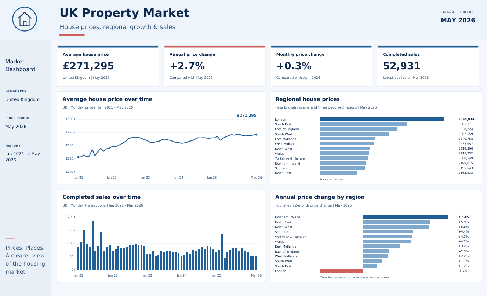
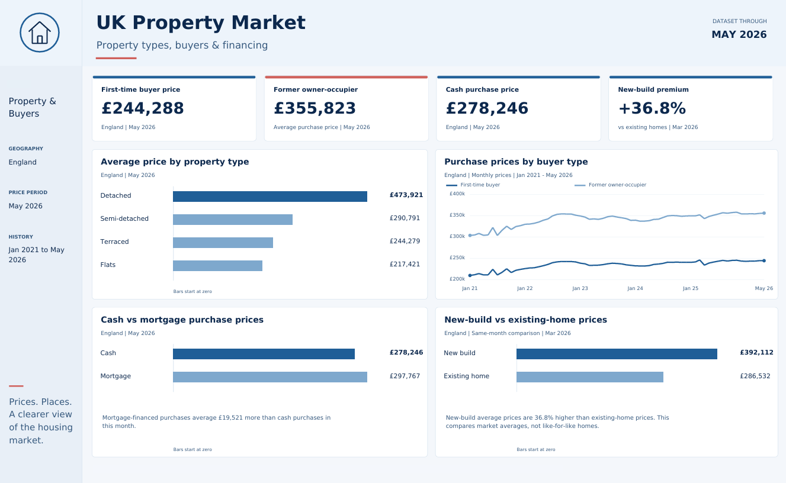

# UK Property Market Dashboard

A two-page data visualisation project exploring UK house prices, regional growth, completed sales, property types, buyer groups and financing patterns using the UK House Price Index dataset through May 2026.

## Dashboard Preview

### 1. Market Dashboard

The first page provides a UK-wide market overview, including headline house-price measures, completed sales, historical price and sales trends, regional house prices and annual regional price changes.

### 2. Property & Buyers

The second page focuses on England and compares property types, first-time buyers and former owner-occupiers, cash and mortgage purchases, and new-build versus existing-home prices.

## Key Insights

- UK average house price: **£271,295** in May 2026
- Annual UK house price change: **+2.7%**
- Monthly UK house price change: **+0.3%**
- Completed sales: **52,931** in the latest available period, March 2026
- London had the highest average regional house price at **£544,814**
- Northern Ireland recorded the strongest annual regional price growth at **+7.4%**
- First-time buyer average price in England: **£244,288**
- Mortgage-financed purchases averaged **£19,521 more** than cash purchases in May 2026
- New-build average prices were **36.8% higher** than existing-home prices in the March 2026 comparison

## Project Files

- [View the full dashboard PDF](UK_Property_Market_Power-BI_Dashboard.pdf)
- `Dashboard_1.png` — Market Dashboard preview
- `Dashboard_2.png` — Property & Buyers preview

## Dataset

The analysis uses the **UK House Price Index (UK HPI)** dataset supplied through May 2026. The full source CSV is not stored in this repository because of its file size.

## Skills Demonstrated

**Data Analysis • Data Visualisation • KPI Design • Trend Analysis • Comparative Analysis • Dashboard Design • Data Storytelling**

## Project Purpose

This project was created for my data analytics portfolio to demonstrate how housing-market data can be transformed into a clear, decision-focused dashboard with headline KPIs, historical trends and geographic comparisons.

## Author

**Vaibhav Panchal**
