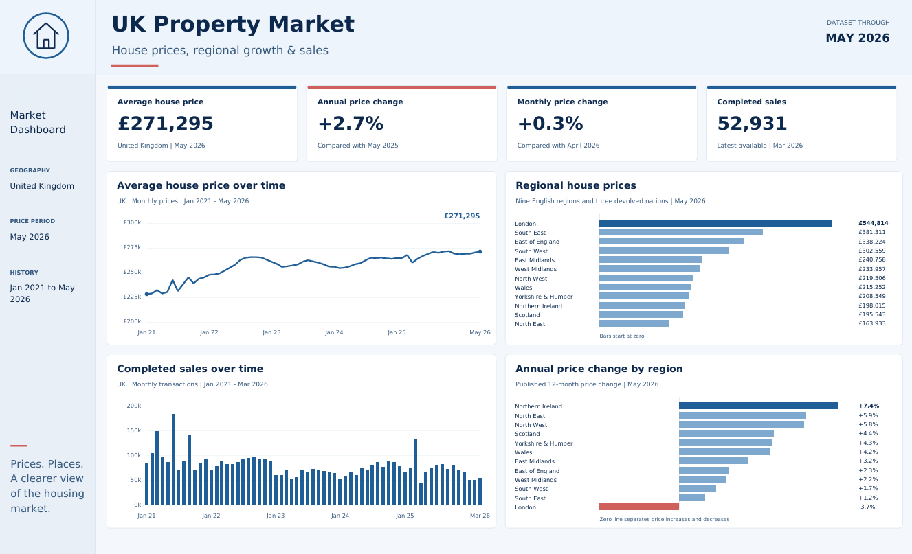
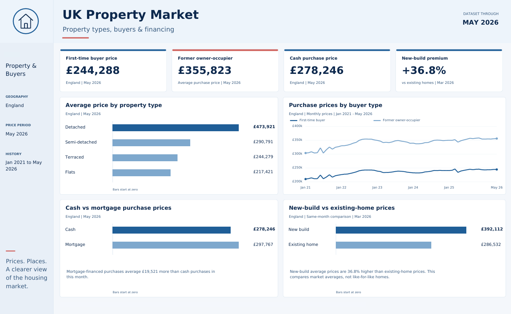

# UK Property Market Dashboard

A two-page data visualisation project exploring UK house prices, regional growth, completed sales, property types, buyer groups and financing patterns using the UK House Price Index dataset through May 2026.

## Dashboard Preview

### 1. Market Dashboard

The first page provides a UK-wide market overview, including headline house-price measures, completed sales, historical price and sales trends, regional house prices and annual regional price changes.

### 2. Property & Buyers

The second page focuses on England and compares property types, first-time buyers and former owner-occupiers, cash and mortgage purchases, and new-build versus existing-home prices.

## Key Insights

- UK average house price: **£271,295** in May 2026
- Annual UK house price change: **+2.7%**
- Monthly UK house price change: **+0.3%**
- Completed sales: **52,931** in the latest available period, March 2026
- London had the highest average regional house price at **£544,814**
- Northern Ireland recorded the strongest annual regional price growth at **+7.4%**
- First-time buyer average price in England: **£244,288**
- Mortgage-financed purchases averaged **£19,521 more** than cash purchases in May 2026
- New-build average prices were **36.8% higher** than existing-home prices in the March 2026 comparison

## Project Files

- [View the full dashboard PDF](UK_Property_Market_Power-BI_Dashboard.pdf)
- `Dashboard_1.png` — Market Dashboard preview
- `Dashboard_2.png` — Property & Buyers preview

## Dataset

The analysis uses the **UK House Price Index (UK HPI)** dataset supplied through May 2026. The full source CSV is not stored in this repository because of its file size. A **910-row extract** covering the dashboard geographies and January 2021–May 2026 is included as [dashboard_data.csv](dashboard_data.csv). Missing values are retained.

## Source and reproducibility

- [Official May 2026 UK HPI release and downloads](https://www.gov.uk/government/statistical-data-sets/uk-house-price-index-data-downloads-may-2026)
- [Exact full CSV used for verification](https://publicdata.landregistry.gov.uk/market-trend-data/house-price-index-data/UK-HPI-full-file-2026-05.csv)
- [Data extract](dashboard_data.csv), [verified headline measures](verified_metrics.json) and [source checksum / extraction scope](data_provenance.json)

Source attribution: HM Land Registry / UK House Price Index. Contains public-sector information licensed under the [Open Government Licence v3.0](https://www.nationalarchives.gov.uk/doc/open-government-licence/version/3/), subject to the publisher's stated exceptions.

The headline figures and derived price differences were checked against the **May 2026 release**, not a later revised dataset. Later releases can revise earlier periods. These figures describe a historical snapshot, not the current market.

To inspect the figures, open the supplied extract or download the linked full CSV and filter it to the geographies and periods listed below. The included extract and validation files were added during a documentation review; they do not describe the tools used to create the original dashboard.

## Metric definitions

| Dashboard measure | Source field / calculation | Geography and period |
|---|---|---|
| Average house price | Published `AveragePrice` | UK, May 2026 |
| Annual / monthly change | Published `12m%Change` / `1m%Change` | UK, May 2026 |
| Completed sales | Published `SalesVolume` | UK, March 2026; latest non-missing month in this release |
| Regional prices / growth | `AveragePrice` / `12m%Change` | Nine English regions plus Wales, Scotland and Northern Ireland |
| First-time / former owner-occupier prices | `FTBPrice` / `FOOPrice` | England, May 2026 |
| Mortgage–cash price difference | `MortgagePrice - CashPrice` = £19,521 | England, May 2026 |
| New-build premium | `(NewPrice / OldPrice - 1) × 100` = 36.8% | England, March 2026 |

The headline UK price is the published UK series, **not an unweighted mean of regional prices**. Price, buyer and new-build comparisons have different geographic or time coverage, shown on the relevant page. Missing recent sales or new-build values are not zero.

## How to recreate the analysis in Power BI

1. Import `dashboard_data.csv`; set `Date` to Date, prices to numeric currency values, published percentage changes to decimal numbers, and sales to whole numbers.
2. Keep `AreaCode` and `Date` as the area-month key. Use a date table for historical charts.
3. Filter headline cards to the explicit geography and period in the definitions above. Do not sum prices across months or across geographic levels.
4. Build monthly UK price/sales charts and the regional comparisons for page 1. Use England rows for page 2's property and buyer comparisons.
5. Use the same-month formulas above for price differences. Display published changes as percentages without multiplying them again: a stored `2.7` means 2.7%, not 270%.

The repository provides **static PNG previews, a PDF, source extract and metric definitions**. An editable `.pbix`/`.pbip` model is not included, so these steps describe how to recreate the analysis rather than recover the original report or DAX.

## Interpretation

The comparisons describe market averages. The new-build premium is not a like-for-like valuation uplift; property mix and location can differ. The mortgage–cash gap does not show that financing causes higher prices. The dashboard supports comparison and further investigation, not an investment recommendation.

## Skills Demonstrated

**Data Analysis • Data Visualisation • KPI Design • Trend Analysis • Comparative Analysis • Dashboard Design • Data Storytelling**

## Project Purpose

This project was created for my data analytics portfolio to demonstrate how housing-market data can be transformed into a clear, decision-focused dashboard with headline KPIs, historical trends and geographic comparisons.

## Author

**Vaibhav Panchal**

